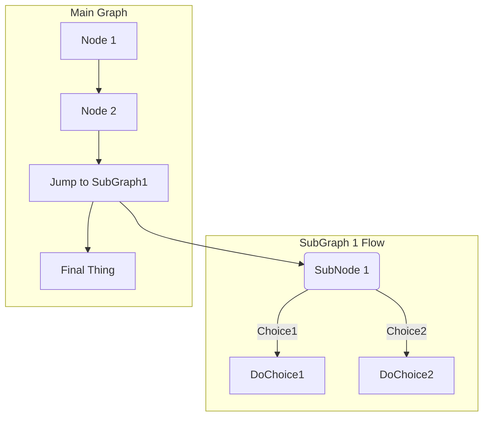

# diatoolsExploration
awesome List of do-it-yourself picasso for office like mermaid draw.io etc - work in progress -

give us some hints of usefull usecases in [call-for-issues](https://github.com/pflegende/diatoolsExploration/issues/1)
:smile:


## mermaid

- also in use, description coming soon
- readTheDocs: https://mermaid-js.github.io/mermaid/#/Setup
- example: https://hackmd.io/RSkzVVtkQjqd_rgzaa505A?both

### e.g. include mermaid flowChart:


### e.g. include mermaid Gant

3Monatsplan ... und nicht die Lerche!
---
```mermaid
gantt

    axisFormat %m.
    title 3 Monate bis Buffalo
    todayMarker stroke-width:5px,stroke:#0f0,opacity:0.5
    %% todayMarker ist der 
    %% gr. Streifen = heute


    %% ---- easy read
    section hint
    Das ist alles eine Blaupause für Denkwütige:a8,
    DER ganz geheime Plan.:a9,
    %% ---- easy read
    section Traum
    %% ---- easy read
    Brainstorming         :a1, 2022-02-16, 30d
    Details     :e2, after a1  , 20d
    Ernsthaft     :e3, after e2, 37d
    Schaffen Wir  :e4, after e3, 53d
    %% ---- easy read
    
    section Wie immer 
    
    %% ---- easy read
    * :g0,
    2.Do Pflegende Löberstr.12 :g1, 2022-02-12, 200d
click g1 href "https://linktr.ee/pflegende"
    
    
    %% ---- easy read    
        10.3.16Uhr -      :crit, milestone, 2022-03-10, 0d
        
        14.4.16Uhr -      :crit, milestone, 2022-04-14, 0d
        
        12.5.16Uhr -      :crit, milestone, 2022-05-12, 0d

        9.6.16Uhr -       :crit, milestone, 2022-06-09, 0d

        14.7.16Uhr -      :crit, milestone, 2022-07-14, 0d    

        11.8.16Uhr -      :crit, milestone, 2022-08-11, 0d

        8.9.16Uhr -       :crit, milestone, 2022-09-08, 0d


    %% ---- easy read
    
    section Wirklichkeit
    
    %% ---- easy read
    
    Osterhasi : crit, 2022-04-13, 3d
    
    12. Mai - Florence Feiern!                 :crit, milestone, 2022-05-12, 0d
    %% ---- easy read

    
        %% ---- easy read
    TWPA 4.-10.7.  :f1, 2022-07-04, 7d
    TWPA23 Planung :f2, after f1, 61d
click f1 href "https://twpa.de"
click f2 href "https://edupad.ch/p/12terMai"
%% > Read more about mermaid here: http://mermaid-js.github.io/mermaid/
%% > https://mermaid-js.github.io/mermaid-live-editor

%% > https://mermaid-js.github.io/mermaid-live-editor/edit#pako:eNpVkE1qw0AMha8itEohvoAXhcZOsgmk0Ow8WQiPnBmS-WEsU4Ltu3ccU2i1kt77nhAasQ2ascRbomjgUisPuT6ayiTbi6P-CkXxPh1ZwAXPzwl2m2OA3oQYrb-9rfxugaAaTwvGIMb6-7xa1St_9jxB3ZwoSojXv87lO0ywb-ynyev_OyZxTh2ajsqOipYSVJReCG7RcXJkdT59XBSFYtixwjK3mjsaHqJQ-TmjQ9QkvNdWQsJS0sBbpEHC19O3v_PK1JbyI9wqzj8k-lxH


```
friendly intrust by linktr.ee/pflegende
`[` https://hackmd.io/RSkzVVtkQjqd_rgzaa505A?both 16.3.2022, 05:49:09 `]`

## some TOC md Generators

coming soon


## draw.io

https://draw.io is a diagramming/whiteboarding visualization application.

This app allows you to store your diagrams in GitHub with fewer permissions than authenicating using OAuth only.

## LL* ... 1st try: more such tools

https://github.com/search?q=draw+dia+charts&type=repositories

[data kraken search:: "md toc online"](https://www.google.de/search?client=opera&q=md+toc+online&sourceid=opera&ie=UTF-8&oe=UTF-8)

`*` ... **LL** this is what we call a Linklist

## off topic - result of curiosity  :P

(may be to move it later to other repo with better focus on this, yet not namend, topic))

https://github.com/marketplace  your suggestion "+" or "-" ..., alternatives for this LL?

https://github.com/marketplace/category/free  - only free apps from gh-market
